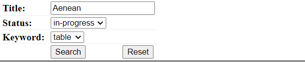
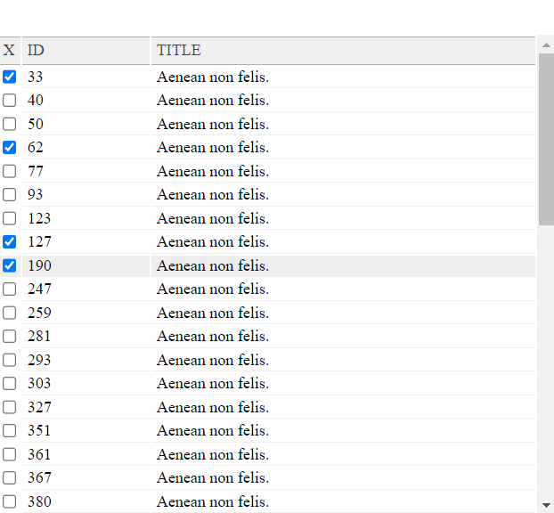
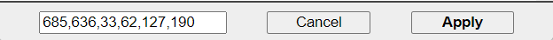
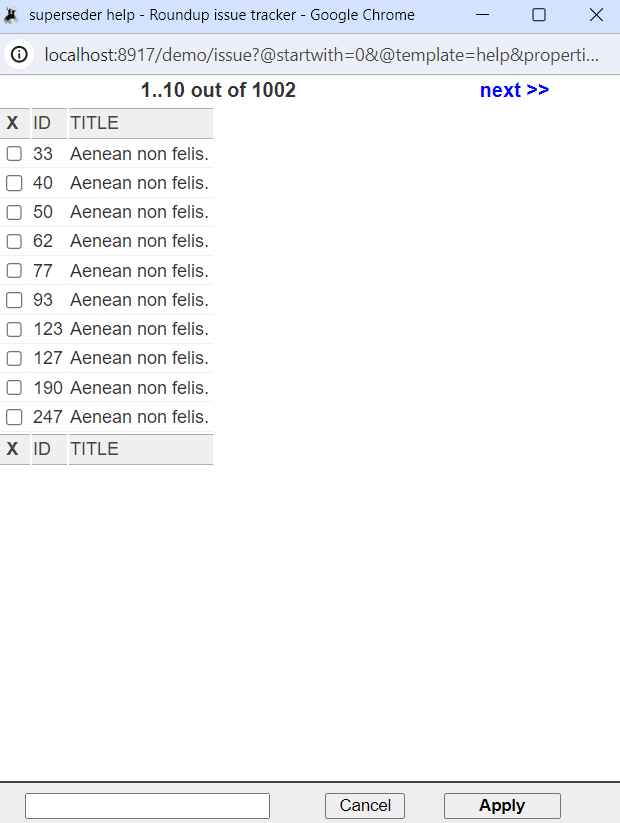

# Development Setup

### Clone mercurial repository.
```shell
hg clone http://hg.code.sf.net/p/roundup/code roundup
```

### Make python virtual env and activate it
```shell
cd roundup
python -m venv .
```
#### For linux and mac
```shell
source bin/activate 
```
#### For windows powershell
```shell
.\scripts\Activate.ps1
```

### Install roundup
```shell
python -m pip install .
```

### Clone tracker only repo.
```shell
git clone https://github.com/UMB-CS-682-Team-03/tracker.git
```

### Init the demo tracker with default ./demo
```shell
roundup-demo -b sqlite
```

### Move the files from tracker dir to demo dir
#### For linux and mac
```shell
cp -r ./tracker/**/* ./demo
cp -r ./tracker/.git ./tracker/.gitignore ./demo
```
#### For windows powershell
```shell
xcopy .\tracker .\demo /s #say yes to all
```

1. Now you are done setting up developing environment.
2. Open the roundup folder in VScode.
3. Any new changes are only to be done in demo directory.
4. git is initialized to track origin in demo directory (for windows check if .git folder is copied to the demo)

#  Roundup - Classhelper
##  `<roundup-classhelper>`
## Why there is need of `<roundup-classhelper>` in the issue tracker?
* The existing ClassHelper implementation in Roundup Issue Tracker uses outdated HTML framesets, which have accessibility limitations, lack advanced features like search and sorting, are difficult to customize, and harder to maintain with modern web development practices.
* The `<roundup-classhelper>`, which is a web component, addresses these shortcomings by providing a modern, accessible, and flexible solution implemented as a web component. It offers improved accessibility, an enhanced user experience with advanced features, easy customization, better maintainability, and a fallback mechanism for browsers that don't support web components.
* Overall, the `<roundup-classhelper>` modernizes and enhances the ClassHelper feature, making it more accessible, user-friendly, and maintainable, while laying the foundation for further improvements and integration with other Roundup features.

## What is classhelper comprised of?
There are three main parts of the roundup-classhelper component:

* **Search Section (optional)**: This section allows users to search for items based on specified fields. For example, users can search for issues by title, status, or keywords. The search section is optional and may not be present in some configurations.
   

* **Select/Info Table Section**: This section displays the search results or a list of available items. If a search section is present, it will show the items matching the search criteria. If no search section is available, it will display all available items. This section may include pagination controls to navigate through large datasets. Additionally, it may have a checkbox for selecting items if the `<roundup-classhelper>` is associated with a form field. However, if there is no associated form field (i.e., "info mode"), this section will act as an information box without selection capabilities.

   
 
* **Accumulator/Submit Section**: This section shows the items selected by the user from the Select/Info Table Section. It serves as an accumulator, allowing users to review and confirm their selections before submitting or updating the associated form field. If the `<roundup-classhelper>` is in "info mode" (without an associated form field), this section may be absent, as there are no items to accumulate or submit.
   

The presence and behavior of these sections can vary depending on the configuration and intended use case of the `<roundup-classhelper>` component. For example, in some scenarios, the Search Section may not be necessary.

## How can you use it?
### Keyboard Usage
The `<roundup-classhelper>` is designed to be fully accessible and navigable using only the keyboard. The tab order and key bindings are as follows:
* **Tab Order**: Users can navigate between the different sections (Search, Select/Info Table, Accumulator/Submit) using the Tab key. The order of focus will be determined by the DOM structure of the component.

* **Search Section**: If present, users can type their search query directly into the search input field using the keyboard.

* **Select/Info Table Section**:
   * Users can navigate through the list of items using the `Up` and `Down` arrow keys.
   * To select/deselect an item, users can press the `Space` key when an item is focused.
   * If pagination controls are present, users can navigate to the `next` or `previous` page using the appropriate links or buttons, which should be accessible via the `Tab` key.
   * Users can also use the `<` and `>` keys to focus on the `Prev` and `Next` buttons for navigating to the previous and next pages, respectively.

* **Accumulator/Submit Section**:
   * Users can navigate to the `Apply` or `Cancel` buttons using the `Tab` key.
   * To submit or cancel the selected values, users can press the `Enter` key when the respective button is focused.
   * Users can navigate to `Submit` button, by pressing `Shift + Enter` from anywhere.
   Enter push makes the thing happen

### Mouse Usage
In addition to keyboard navigation, the `<roundup-classhelper>` component can be used with a mouse or other pointing device:

* **Search Section**: Users can click inside the search input field and type their query.


* **Select/Info Table Section**:

   * Users can click on a table row to select/deselect an item.
   * If pagination controls are present, users can click on the appropriate links or buttons to navigate to the next or previous page.

* **Accumulator/Submit Section**:

   * If present, users can click on the submit button or any other controls in this section to trigger the submission or update action.

## Guide for using/deploying roundup-classhelper in a tracker
#### Which tag to use and where to place it.
 * To customise your own classhelper you can introduce of the `<roundup-classhelper>` web component.

 * Locate the appropriate template files (e.g., issue.html) where you want to use the `<roundup-classhelper>`.
 
 * Wrap the existing ClassHelper link with the `<roundup-classhelper>` tag.
##### Before the code would look like this.
```html
<th i18n:translate="">Nosy List</th>
<td>
<span tal:replace="structure context/nosy/field" />
<span tal:condition="context/is_edit_ok" tal:replace="structure
   python:db.user.classhelp('username,realname,address', property='nosy', width='600'" />
</td>
  ```

##### After adding the `<roundup-classhelper>`, it should look like this.
```html
<th i18n:translate="">Nosy List</th>
<td>
<span tal:replace="structure context/nosy/field" />
<roundup-classhelper data-popup-title="Nosy List Classhelper - {itemDesignator}" data-search-with="username,phone,roles[]">
   <span tal:condition="context/is_edit_ok" tal:replace="structure python:db.user.classhelp('username,realname,address', property='nosy', width='600')" />    
</roundup-classhelper>
</td>
  ```

### Setting Attributes on `</roundup-classhelper>`

#### Setting the `data-popup-title` attribute is optional.

* Adding `data-popup-title` changes the title of the popup window with the value of the attribute.
* `{itemDesignator}` can be used inside the attribute value to replace it with the current classhelper usage context.
* eg. `data-popup-title="Nosy List Classhelper - {itemDesginator}"` will have the popup window title `Nosy List Classhelper - users`

#### Setting the `data-search-with` attribute is optional.

* Adding `data-search-with` specifies the fields that can be used for searching (e.g., `data-search-with="title,status,keyword"`).

* Optionally, customize the search parameters using the following syntax:
    * `"status[]"`: Displays a dropdown for the "status" field, showing all possible values. 
         ```html
         <roundup-classhelper data-search-with="title,status[],    keyword[]">
            <span tal:condition="context/is_edit_ok" tal:replace="structure python:db.issue.classhelp('id,title', property='superseder', pagesize=100)" />
         </roundup-classhelper>
         ```
    * `"keyword[]+name"`: Sorts the "keyword" dropdown in ascending order by name.
         ```html
         <roundup-classhelper data-search-with="title,status[],keyword[]+name">
            <span tal:condition="context/is_edit_ok" tal:replace="structure python:db.issue.classhelp('id,title', property='superseder', pagesize=100)" />
         </roundup-classhelper>
         ```
    * `"keyword[]-name"`: Sorts the "keyword" dropdown in descending order by name.
         ```html
         <roundup-classhelper data-search-with="title,status[],keyword[]-name">
            <span tal:condition="context/is_edit_ok" tal:replace="structure python:db.issue.classhelp('id,title', property='superseder', pagesize=100)" />
         </roundup-classhelper>
         ```
   * If the `roles` field cannot be displayed as a dropdown, it will be treated as a text-only match.
   
### User ClassHelper
   * To emulate the normal user ClassHelper behavior (e.g., for username and roles), use the following attribute values:
      ``` html
      <roundup-classhelper data-search-with="username,roles[]">
         <!-- ClassHelper content -->
      </roundup-classhelper>
      ```
   
### Fallback Mechanism
   If the user's browser doesn't support web components, the `<roundup-classhelper>` will automatically fall back to use ClassHelper link.

   

### Error Handling
   * In case of errors, the component will use the fallback to use ClassHelper link while alerting the user.
   * For further debugging, users can open the browser console and inspect the results.

   

### Refreshing `classhelper.css`
   In case of issues with the `<roundup-classhelper>` component, you can try refreshing the `classhelper.css` file by following these steps:
   * Open your Roundup issue tracker in a web browser.
   * In the address bar, append `@@file/classhelper.css` to the end of your Roundup URL. For example, if your Roundup URL is `http://example.com/tracker`, the URL you should visit would be `http://example.com/tracker/@@file/classhelper.css`
   * This will open the `classhelper.css` file in your browser.
   * To perform a hard refresh of the page, which forces the browser to reload the file and associated resources from the server, press `Ctrl+Shift+R` (on Windows and Linux) or `Cmd+Shift+R` (on macOS).

   This will force the browser to reload the classhelper.css file and any other associated resources, potentially resolving any issues caused by cached or outdated files.

## Adding Roles
   * If you want to enable the display of roles in the `<roundup-classhelper>` component, you'll need to have an `interfaces.py` file with the following code:

      ```python
      from roundup.rest import Routing, RestfulInstance,  _data_decorator

      class RestfulInstance:

      @Routing.route("/roles", 'GET')
      @_data_decorator
      def get_roles(self, input):
        """Return all defined roles. The User class property
           roles is a string but simulate it as a MultiLink
           to an actual Roles class.
        """
        return 200, {"collection": [ {"id": rolename, "name": rolename}
                  for rolename in list(self.db.security.role.keys())]}
      ```

      By including this code in the `interfaces.py` file, you enable the `<roundup-classhelper>` component to handle roles effectively, allowing users to search, filter, and select roles within the component.

# Installing and Setup
Copy the following files into your Roundup instance `html` directory:

- `classhelper.css` ([[GitHub file link](https://github.com/UMB-CS-682-Team-03/tracker/blob/main/html/classhelper.css)])
- `classhelper.js` ([[GitHub file link](https://github.com/UMB-CS-682-Team-03/tracker/blob/main/html/classhelper.js)])

After copying these files, you can use the `<roundup-classhelper>` component in your Roundup templates.
   


# Running the Test Suite

### Requirements
- Selenium WebDriver
- GeckoDriver (for Firefox)

### Installation Instructions
1. **Selenium Installation**:
   Open your terminal or command prompt and run:
   python -m pip install selenium==4.18.1

2. **GeckoDriver Installation**:   
	pip install geckodriver==0.0.1


#### To run the code in a Headless Environment:
	Set "HEADLESS = TRUE " in line 12.

#### To run the code without Headless:
	Set " HEADLESS = FALSE"  in line 12. 


### Run the test suite
	python test_classhelper.py

